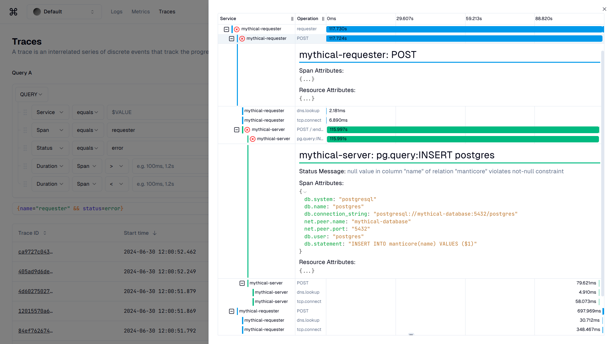

# obs-stack

Hi, world. I'm Duc Le, a graduate from Hanoi University of Science and Technology. This repository holds the source code for my thesis project, "Observability Platform: Full-Stack Observability for Modern Applications".

<!-- A 2 x 2 grid of images -->

<table>
  <tr>
    <td>
      
      
<strong>Figure 0.1:</strong>  Query builder interface with flexible time controls</strong>

    </td>
    <td>
      
      
<strong>Figure 0.2:</strong> Aggregated log overview with filtering capabilities

    </td>
  </tr>
  <tr>
    <td>
      
      
<strong>Figure 0.3:</strong> Real-time metrics dashboard for monitoring system performance

    </td>
    <td>
      
      
<strong>Figure 0.4:</strong> Tracing interface displaying request flow across services

    </td>
  </tr>
</table>

## 1. Introduction

  
  
<em><strong>Figure 1.1:</strong> The software architecture evolution</em>

The rise of containerization and microservices in cloud-native environments has transformed software architecture, increasing the management complexity of distributed systems. Observability now plays a vital role in enhancing customer experience, reducing downtime, and improving Mean Time to Recovery (MTTR). This thesis proposes a simple observability platform that builds on open-source technologies and offers advanced capabilities.

  
  
<em><strong>Figure 1.2:</strong> The three pillars of observability</em>

The platform integrates monitoring, logging, tracing,
strict multi-tenant access control, and AI-driven workflow automation. A similar paradigm is currently being adopted by Viettel Cloud, a leading cloud service provider in Vietnam.

## 2. Architecture

Below is the high-level architecture of the observability platform.

  
  
<em><strong>Figure 2:</strong> The high-level architecture of the observability platform</em>

## 3. Contributions

### 3.1. Strict multi-tenant access control

### 3.1.1. The problem

Open-source telemetry solutions like Loki, Mimir, and Tempo support multi-tenant-aware data layers but lack a secure mechanism to verify the identity of requests, which is a common enterprise requirement. In addition to telemetry data, non-multi-tenant resources also need to be protected. This observability platform is thoughtfully designed to achieve this goal and integrate several performance optimizations.

### 3.1.2. The solution

I address the issue by introducing an authentication layer before telemetry services and general databases. The database is designed to include a project ID foreign key for every tenant-aware resource. Besides JWT, these resources require an X-ProjectID header for a preflight check. After retrieving the user for the JWT validation, the system checks if the user's project list contains the X-ProjectID value. The resource is always retrieved to check the project ID before getting, updating, and deleting operations. The platform will raise an exception if the resource is found but the project ID does not match.

  
  
<em><strong>Figure 3.1:</strong> A series of filters to validate incoming requests</em>

### 3.2. Rate limiting by IP and project

### 3.2.1. The problem

High-traffic ingestion requires effective rate limiting to prevent DDoS attacks and ensure fair usage. Traditional load balancer (LB) rate limiters only limit by IP, which is insufficient for comprehensive network control.

### 3.2.2. The solution

I implemented several layers of rate limiting. PerMinutePerIP and PerHourPerIP rate limits are applied before authentication, preventing unnecessary load on the core database. After authentication, PerMinutePerProject and PerHourPerProject rate limits are used, ensuring project-level control.

  
  
<em><strong>Figure 3.2:</strong> A series of middlewares to control incoming requests</em>

### 3.3. Secure GitHub-like API token generation

### 3.3.1. The problem

API tokens are an excellent choice because they are highly secure, easier for developers to use than JWT tokens, and are opaque strings that do not reveal any clues about the claims structure. Many leading API-first companies, such as Stripe, Twilio, and SendGrid, use them.

In the context of this observability platform, API tokens are the ideal solution as they offer a convenient method to represent the user without requiring a sign-in.

### 3.3.2. The solution

API tokens must be handled with the same care as passwords, as they grant access. Tokens are irretrievable by design, stored using SHA-256 hashing to prevent theft. Using tokens as primary keys minimizes hash collisions, while adding a checksum reduces latency by quickly validating tokens without database queries. Displaying each token’s creation date aids monitoring, and the "ost_" prefix enables GitHub’s secret scanning to detect exposure and revoke keys automatically. Formatting tokens in snake_case supports easy copying, and options to delete or disable tokens on demand simplify revocation and migration.

  
  
<em><strong>Figure 3.3:</strong> The format of the API token</em>

### 3.4. Secure template-based query generation

### 3.4.1. The problem

Generating queries using a query builder involves complex conditional statements, making it prone to security issues like Cross-Site Scripting (XSS).

### 3.4.2. The solution

I defined the grammar for query generation to consist of three components: field, operator, and values. Each field’s operator has specific templating rules, formatted using LiquidJS, a secure template engine based on Shopify’s Liquid syntax. Liquid templates are highly readable, fault-tolerant, and do not use `eval` or `new Function`, ensuring security. Using a template-engine-based solution also requires attention to popular template attacks like Client-Side Template Injection (CSTI) and Server-Side Template Injection (SSTI). So far, the library has been extremely secure and safe to use. The library's history of vulnerabilities can be found in Snyk Vulnerability Database.

  
  
<em><strong>Figure 3.4:</strong> Sample query operator grammar definitions</em>

### 3.5. Workflow orchestration

### 3.5.1. The problem

The platform has already addressed the challenges of ingesting and querying telemetry data. Now, the focus is on extracting meaningful insights from this data efficiently.

### 3.5.2. The solution

Jupyter Notebooks have gained widespread adoption among data scientists as the go-to tool for rapid prototyping and exploratory analysis. To support these use cases at scale, the platform requires an enterprise-level Data Platform that is flexible yet powerful.

  
  
<em><strong>Figure 3.5:</strong> The Airflow setup to orchestrate workflows</em>

Airflow, chosen as the orchestration tool, schedules and executes Jupyter Notebooks within Docker containers using Directed Acyclic Graphs (DAGs). Dynamic DAGs are created by parameterizing the Python DAG file and generating configurations through Spring Boot's templating engine, then submitted via Airflow's API for scheduling.

Jupyter Notebooks run in Docker containers to ensure a consistent, isolated runtime environment. These Docker images include all required dependencies, ensuring reliable execution across systems and eliminating dependency issues. This setup allows data scientists to develop and test notebooks locally, then seamlessly upload them for execution on the platform.
